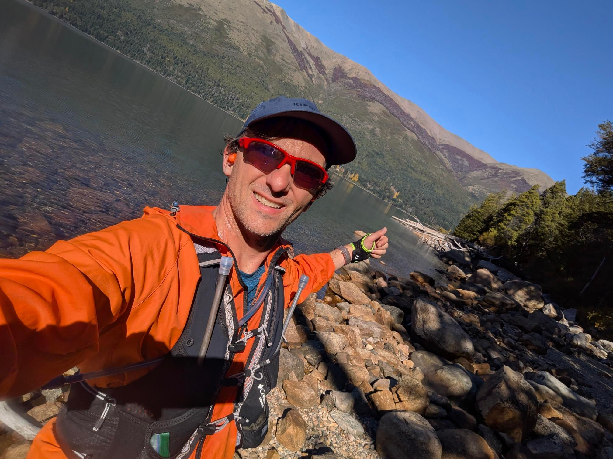

## 📊 Estadísticas Clave
- **Distancia:** 23.46 km
- **Desnivel Positivo:** 819.0 m 🏔️
- **Tiempo en movimiento:** 177:27
- **Tipo de actividad:** Run

## 🗺️ Mapa y Recorrido


## ⏱️ Vueltas (Laps)
| Lap | Distancia | Tiempo | Ritmo | FC Med |
| :--- | :--- | :--- | :--- | :--- |
| 1 | 9.64 km | 67:35 | 7:00 | 143.5 |
| 2 | 2.89 km | 34:56 | 12:05 | 145.9 |
| 3 | 11.04 km | 74:55 | 6:47 | 143.8 |

## 📸 Fotos

---
*Generado automáticamente vía API de Strava.*
