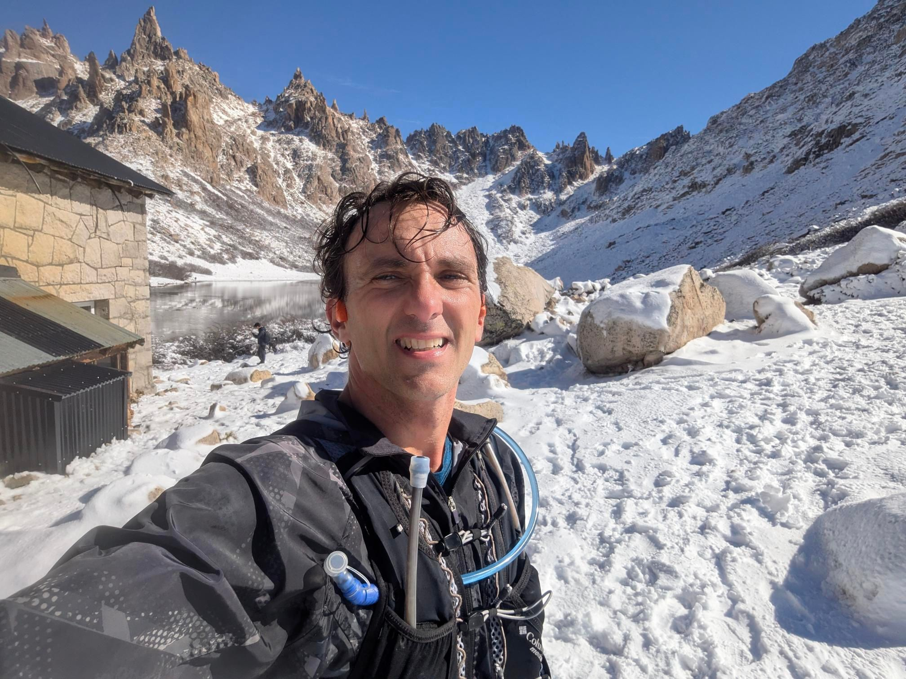
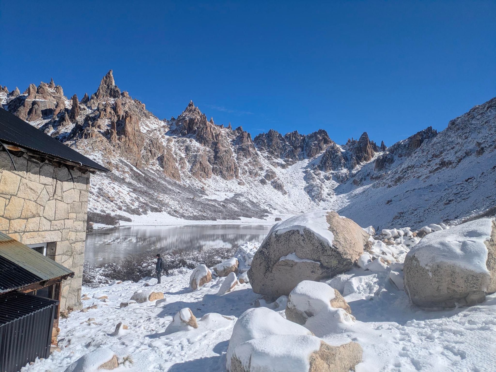
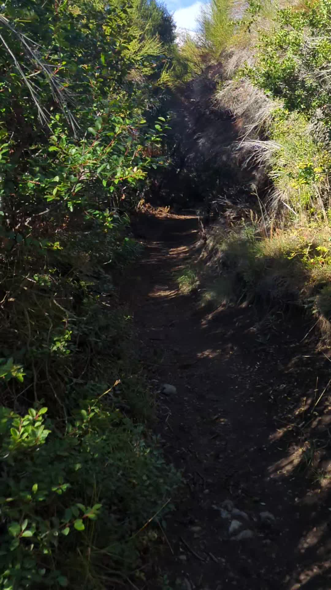
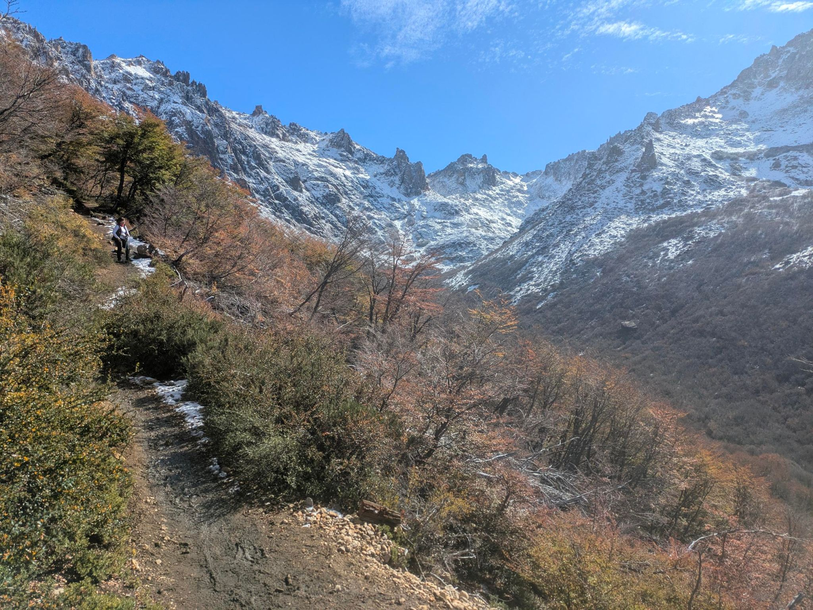

## 📊 Estadísticas Clave
- **Distancia:** 31.25 km
- **Desnivel Positivo:** 1419.0 m 🏔️
- **Tiempo en movimiento:** 270:30
- **Tipo de actividad:** Run

## 🗺️ Mapa y Recorrido


## ⏱️ Vueltas (Laps)
| Lap | Distancia | Tiempo | Ritmo | FC Med |
| :--- | :--- | :--- | :--- | :--- |
| 1 | 1.0 km | 6:01 | 6:01 | 117.3 |
| 2 | 1.0 km | 6:10 | 6:10 | 148.4 |
| 3 | 1.0 km | 6:02 | 6:02 | 161.5 |
| 4 | 1.0 km | 6:08 | 6:08 | 156.7 |
| 5 | 1.0 km | 8:22 | 8:22 | 154.7 |
| 6 | 1.0 km | 8:33 | 8:33 | 160.7 |
| 7 | 1.0 km | 7:54 | 7:54 | 147.5 |
| 8 | 1.0 km | 6:50 | 6:50 | 140.4 |
| 9 | 1.0 km | 6:45 | 6:45 | 138.5 |
| 10 | 1.0 km | 9:20 | 9:20 | 130.6 |
| 11 | 1.0 km | 12:14 | 12:14 | 141.6 |
| 12 | 1.0 km | 12:13 | 12:13 | 147.7 |
| 13 | 1.0 km | 13:29 | 13:29 | 150.4 |
| 14 | 1.0 km | 11:03 | 11:03 | 136.1 |
| 15 | 1.0 km | 12:37 | 12:37 | 143.5 |
| 16 | 1.0 km | 16:07 | 16:07 | 154.9 |
| 17 | 1.0 km | 18:05 | 18:05 | 153.6 |
| 18 | 1.0 km | 9:48 | 9:48 | 118.2 |
| 19 | 1.0 km | 8:17 | 8:17 | 132.1 |
| 20 | 1.0 km | 6:48 | 6:48 | 129.0 |
| 21 | 1.0 km | 8:57 | 8:57 | 148.1 |
| 22 | 1.0 km | 8:40 | 8:40 | 150.3 |
| 23 | 1.0 km | 7:08 | 7:08 | 152.5 |
| 24 | 1.0 km | 6:06 | 6:06 | 150.6 |
| 25 | 1.0 km | 6:10 | 6:10 | 153.7 |
| 26 | 1.0 km | 6:02 | 6:02 | 149.8 |
| 27 | 1.0 km | 5:36 | 5:36 | 150.5 |
| 28 | 1.0 km | 4:59 | 4:59 | 148.2 |
| 29 | 1.0 km | 6:47 | 6:47 | 147.0 |
| 30 | 1.0 km | 8:44 | 8:44 | 151.7 |
| 31 | 1.0 km | 5:43 | 5:43 | 148.8 |
| 32 | 0.47 km | 12:09 | 26:01 | 150.3 |

## 📸 Fotos

---
*Generado automáticamente vía API de Strava.*
